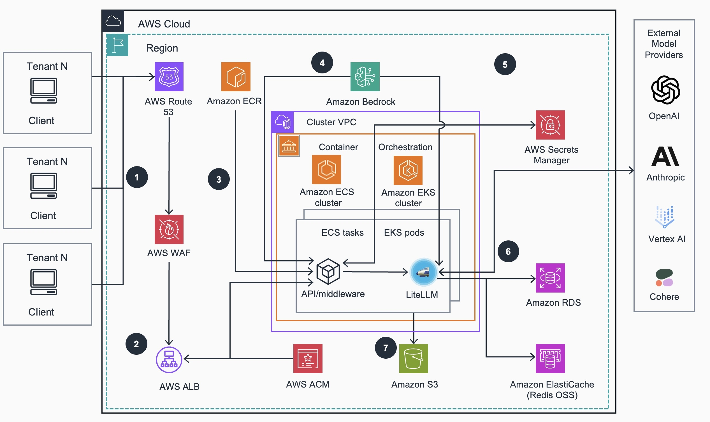

# Guidance for Multi-Provider Generative AI Gateway on AWS

Project ACTIVE as of Feb 15, 2025

## Table of contents

- [Project Overview](#project-overview)
- [Architecture](#architecture)
- [AWS Services in this Guidance](#aws-services-in-this-Guidance)
- [Cost](#cost)
   - [Cost Considerations](#cost-considerations)
   - [Cost Components](#cost-components)
   - [Key Factors Influencing AWS Infrastructure Costs](#key-factors-influencing-aws-infrastructure-costs)
   - [Sample Cost Tables](#sample-cost-tables)
- [Security](#security)
- [How to Deploy](#how-to-deploy)
- [Open Source Library](#open-source-library)
- [Notices](#notices)

## Project Overview

This project provides a simple Terraform deployment of [LiteLLM](https://github.com/BerriAI/litellm) into Amazon Elastic Container Service (ECS) and Elastic Kubernetes Service (EKS) platforms on AWS. It aims to be pre-configured with defaults that will allow most users to quickly get started with LiteLLM.

It also provides additional features on top of LiteLLM such as an AWS Bedrock Interface (instead of the default OpenAI interface), support for AWS Bedrock Managed Prompts, Chat History, and support for Okta Oauth 2.0 JWT Token Auth.

If you are unfamiliar with LiteLLM, it provides a consistent interface to access all LLM providers so you do not need to edit your code to try out different models. It allows you to centrally manage and track LLM usage across your company at the user, team, and api key level. You can configure budgets and rate limits, restrict access to specific models, and set up retry/fallback routing logic across multiple providers. It provides cost saving measures like prompt caching. It provides security features like support for AWS Bedrock Guardrails for all LLM providers. Finally, it provides a UI where administrators can configure their users and teams, and users can generate their api keys and test out different LLMs in a chat interface.

## Architecture

### Architecture steps

1. Tenants/Client applications access the LiteLLM gateway proxy API through [Amazon Route 53](https://aws.amazon.com/route53/) URL endpoint which is protected against common web exploits using [AWS Web Application Firewall (WAF)](https://aws.amazon.com/waf/).
2. AWS WAF forwards requests to an [Application Load Balancer (ALB)](https://aws.amazon.com/elasticloadbalancing/application-load-balancer/) to automatically distribute incoming application traffic to [Amazon Elastic Container Service (ECS)](https://aws.amazon.com/ecs/) tasks or to [Amazon Elastic Kubernetes Service (EKS)](https://aws.amazon.com/eks/) pods (depending on selected container orchestration platform) running LiteLLM Generative AI gateway containers. An AWS TLS/SSL secures traffic to the load balancer using a certificate issued by [AWS Certificate Manager (ACM)](https://aws.amazon.com/certificate-manager/).
3. Container images for API/middleware and LiteLLM applications are built during guidance deployment and pushed into the the [Amazon Elastic Container registry (ECR)](http://aws.amazon.com/ecr/). They are used for deployment to Amazon ECS Fargate or Amazon EKS clusters that run these applications as containers in ECS tasks or EKS pods, respectively. LiteLLM provides a unified application interface for configuration and interacting with LLM providers. The API/middleware also integrates natively with [Amazon Bedrock](https://aws.amazon.com/bedrock/) to enable features not supported by [LiteLLM OSS project](https://docs.litellm.ai/).
4. Amazon Bedrock provides model access, guardrails, prompt caching and routing to enhance the Generative AI gateway and additional controls for clients through a unified API. Access to required Bedrock models will need be properly [configured](https://docs.aws.amazon.com/bedrock/latest/userguide/model-access-modify.html).
5. External model providers providers (OpenAI, Anthropic, Vertex AI etc.) are configured using LiteLLM Admin UI to enable additional LLM model access via unified application interface. Pre-existing configurations of third-party providers are integrated into the Gateway using LiteLLM APIs.
6. LiteLLM integrates with [Amazon ElastiCache (Redis OSS)](https://aws.amazon.com/elasticache/), [Amazon Relational Database Service (RDS)](https://aws.amazon.com/rds/), and [AWS Secrets Manager](https://aws.amazon.com/secrets-manager/) services. Amazon ElastiCache enables multi-tenant distribution of application settings and prompt caching. Amazon RDS enables persistence of virtual API keys and other configuration settings provided by LiteLLM. AWS Secrets Manager stores external model provider credentials and other sensitive settings securely.
7. LiteLLM and the API/middleware store application logs in the dedicated [Amazon S3](https://aws.amazon.com/s3) storage bucket for troubleshooting and access analysis.
   
### AWS Services in this Guidance

| **AWS Service**                                                                                         | **Role**           | **Description**                                                                                             |
| ------------------------------------------------------------------------------------------------------- | ------------------ | ----------------------------------------------------------------------------------------------------------- |
| [Amazon Bedrock](https://aws.amazon.com/bedrock/)                                    | Core service       | Manages Single API access to multiple Foundational Models                                                   |
| [Amazon Elastic Container Service](https://aws.amazon.com/ecs/) ( ECS)               | Core service       | Manages application platform and on-demand infrastructure for LiteLLM container orchestration.              |
| [Amazon Elastic Kubernetes Service](https://aws.amazon.com/eks/) ( EKS)              | Core service       | Manages Kubernetes control plane and compute nodes for LiteLLM container orchestration.                     |
| [Amazon Elastic Compute Cloud](https://aws.amazon.com/ec2/) (EC2)                    | Core service       | Provides compute instances for EKS compute nodes and runs containerized applications.                       |
| [Amazon Virtual Private Cloud](https://aws.amazon.com/vpc/) (VPC)                    | Core Service       | Creates an isolated network environment with public and private subnets across multiple Availability Zones. |
| [Amazon Web Applications Firewall](https://aws.amazon.com/waf/) (WAF)                | Core Service       | Protect guidance applications from common exploits                                                          |
| [Amazon Elastic Container Registry](http://aws.amazon.com/ecr/) (ECR)                | Supporting service | Stores and manages Docker container images for EKS deployments.                                             |
| [Elastic Load Balancer](https://aws.amazon.com/elasticloadbalancing/) (ALB)          | Supporting service | Distributes incoming traffic across multiple targets in the EKS cluster.                                    |
| [Amazon Simple Storage Service ](https://aws.amazon.com/s3) (S3)                     | Supporting service | Provides persistent object storage for Applications logs and other related data.                            |
| [Amazon Relational Database Service ](https://aws.amazon.com/rds/) (RDS)             | Supporting service | Enables persistence of virtual API keys and other configuration settings provided by LiteLLM.               |
| [Amazon ElastiCache Service (Redis OSS) ](https://aws.amazon.com/elasticache/) (OSS) | Supporting service | Enables multi-tenant distribution of application settings and prompt caching.                               |
| [AWS Route 53](https://aws.amazon.com/route53/)                                      | Supporting Service | Routes users to the guidance application via DNS records                                                    |
| [AWS Identity and Access Management](https://aws.amazon.com/iam/) (IAM)              | Supporting service | Manages access to AWS services and resources securely, including ECS or EKS cluster access.                 |
| [AWS Certificate Manager](https://aws.amazon.com/certificate-manager/) (ACM)         | Security service   | Manages SSL/TLS certificates for secure communication within the cluster.                                   |
| [Amazon CloudWatch](https://aws.amazon.com/cloudwatch/)                              | Monitoring service | Collects and tracks metrics, logs, and events from ECS, EKS and other AWS resources provisoned in the guidance   |
| [AWS Secrets Manager](https://aws.amazon.com/secrets-manager/)                       | Management service | Manager stores external model provider credentials and other sensitive settings securely.                   |
| [AWS Key Management Service](https://aws.amazon.com/kms/) (KMS)                      | Security service   | Manages encryption keys for securing data in EKS and other AWS services.                                    |

**NOTE** For any guidance deployment, either Amazon ECS or EKS container orchestration platform can be used, but not both.

## Cost

### Cost Considerations

When implementing this guidance on AWS, it's important to understand the various factors that contribute to the overall cost. This section outlines the primary cost components and key factors that influence pricing.

### Cost Components

The total cost of running this solution can be broadly categorized into two main components:

1. **LLM Provider Costs**: These are the charges incurred for using services from LLM providers such as Amazon Bedrock, Amazon SageMaker, Anthropic, and others. Each provider has its own pricing model, typically based on factors like the number of tokens processed, model complexity, and usage volume.

2. **AWS Infrastructure Costs**: These are the costs associated with running the Gen AI Gateway proxy server on AWS infrastructure. This includes various AWS services and resources used to host and operate the solution.

### Key Factors Influencing AWS Infrastructure Costs

While the default configuration provides a starting point, the actual cost of running the LiteLLM-based proxy server on AWS can vary significantly based on your specific implementation and usage patterns. Some of the major factors that can impact scaling and cost include:

1. **Compute Instances**: The type and number of EC2 instances used to host the LiteLLM container as a proxy. Instance type selection affects both performance and cost.

2. **EBS Storage**: The type and size of EBS volumes attached to the EC2 instances can influence both performance and cost.

3. **Autoscaling Configuration**: The autoscaling policies configured for EKS/ECS clusters will affect how the solution scales in response to demand, impacting both performance and cost.

4. **Traffic Patterns**: The shape and distribution of LLM requests, including factors such as:

   - Request/response payload sizes
   - Tokens per minute (TPM)
   - Requests per minute (RPM)
   - Concurrency levels
   - Model latency (from downstream LLM providers)
   - Network latency between AWS and LLM providers

5. **Caching Configuration**: Effective caching can reduce the number of requests to LLM providers, potentially lowering costs but requiring additional resources.

6. **Database Storage**: The amount of storage required for managing virtual keys, organizations, teams, users, budgets, and per-request usage tracking.

7. **High Availability and Resiliency**: Configurations for load balancing, routing, and retries can impact both reliability and cost.

8. **Logging Level**: The configured logging level affects storage and potentially network egress costs.

9. **Networking Costs**: This includes data transfer charges and the cost of running NAT gateways for outgoing calls to LLM providers.

It's important to note that this is not an exhaustive list of cost factors, but rather highlights some of the major contributors to the overall cost of the solution.

### Customer Responsibility

While this implementation guide provides default configurations, customers are responsible for:

1. Configuring the solution to their optimal settings based on their specific use case and requirements.
2. Monitoring and managing the costs incurred from running the proxy server on AWS infrastructure.
3. Managing and optimizing the costs associated with their chosen LLM providers.

Customers should regularly review their AWS service usage patterns, adjust configurations as needed, and leverage AWS cost management tools to optimize their spending.

We recommend creating a [budget](https://alpha-docs-aws.amazon.com/awsaccountbilling/latest/aboutv2/budgets-create.html) 
through [AWS Cost Explorer](http://aws.amazon.com/aws-cost-management/aws-cost-explorer/) to
help manage costs. Prices are subject to change and also depend on model provider usage patterns/volume of data. For full details, refer to the pricing webpage for each AWS service used in this guidance.

### Sample cost tables

The following tables provide a sample cost breakdown for deploying this guidance on ECS and EKS container orchestration platforms with the default parameters in the `us-east-1` (N. Virginia) region for one month. These estimates are based on the AWS Pricing Calculator outputs for the full deployments as per guidance and are subject to changes in underlying services configuration.

**For ECS container orchestration platform**

| **AWS service**                          | Dimensions                                                                                        | Cost, month [USD] |
| ---------------------------------------- | ------------------------------------------------------------------------------------------------- | ----------------- |
| Amazon Elastic Container Service (ECS)   | OS: Linux, CPU Architecture: ARM, 24 hours, 2 tasks per day, 4 GB Memory, 20 GB ephemeral storage | 115.33            |
| Amazon Virtual Private Cloud (VPC)       | 1 VPC, 4 subnets, 1 NAT Gateway, 1 public IPv4, 100 GB outbound data per month                    | 50.00             |
| Amazon Elastic Container Registry (ECR)  | 5 GB image storage/month                                                                          | 0.50              |
| Amazon Elastic Load Balancer (ALB)       | 1 ALB, 1 TB/month                                                                                 | 24.62             |
| Amazon Simple Storage Service (S3)       | 100 GB/month                                                                                      | 7.37              |
| Amazon Relational Database Service (RDS) | 2 db.t3.micro nodes, 100% utilization, multi-AZ, 2 vCPU,1 GiB Memory                               | 98.26             |
| Amazon ElastiCache Service (Redis OSS)   | 2 cache.t3.micro nodes, 2 vCPU, 0.5 GiB Memory, Upto 5 GB Network performance, 100% utilization   | 24.82             |
| Amazon Route 53                          | 1 hosted zone, 1 million standard queries/month                                                    | 26.60             |
| Amazon CloudWatch                        | 25 metrics to preserve                                                                            | 12.60             |
| AWS Secrets Manager                      | 5 secrets, 30 days, 1 million API calls per month                                                 | 7.00              |
| AWS Key Management Service (KMS)         | 1 key, 1 million symmertic requests                                                                | 4.00              |
| AWS WAF                                  | 1 web ACL, 2 rules                                                                                | 7.00              |
| AWS Certificate Manager                  | 1 Certificate                                                                                     | free              |
| **TOTAL**                                |                                                                                                   | **$378.10/month** |

For detailed cost estimates for deployment on ECS platform, it is recommended to create an AWS Price calculator like [this:](https://calculator.aws/#/estimate?id=8bce7fe949694f4ddbb08c9974ddcda9d13b1398)

**For EKS container orchestration platform:**

| **AWS service**                          | Dimensions                                                                                      | Cost, month [USD] |
| ---------------------------------------- | ----------------------------------------------------------------------------------------------- | ----------------- |
| Amazon Elastic Kubernetes Service (EKS)  | 1 control plane                                                                                 | 73.00             |
| Amazon Elastic Compute Cloud (EC2)       | EKS Compute Nodes, 2 nodes t4g.medium                                                           | 49.06             |
| Amazon Virtual Private Cloud (VPC)       | 1 VPC, 4 subnets, 1 NAT Gateway, 1 public IPv4, 100 GB outbound data per month                  | 50.00             |
| Amazon Elastic Container Registry (ECR)  | 5 GB image storage/month                                                                        | 0.50              |
| Amazon Elastic Load Balancer (ALB)       | 1 ALB, 1 TB/month                                                                               | 24.62             |
| Amazon Simple Storage Service (S3)       | 100 GB/month                                                                                    | 7.37              |
| Amazon Relational Database Service (RDS) | 2 db.t3.micro nodes, 100% utilization, multi-AZ, 2 vCPU,1 GiB Memory                             | 98.26             |
| Amazon ElastiCache Service (Redis OSS)   | 2 cache.t3.micro nodes, 2 vCPU, 0.5 GiB Memory, Upto 5 GB Network performance, 100% utilization | 24.82             |
| Amazon Route 53                          | 1 hosted zone, 1 million standard queries/month                                                  | 26.60             |
| Amazon CloudWatch                        | 25 metrics to preserve                                                                          | 12.60             |
| AWS Secrets Manager                      | 5 secrets, 30 days, 1 million API calls per month                                               | 7.00              |
| AWS Key Management Service (KMS)         | 1 key, 1 million symmertic requests                                                              | 4.00              |
| AWS WAF                                  | 1 web ACL, 2 rules                                                                              | 7.00              |
| AWS Certificate Manager                  | 1 Certificate                                                                                   | free              |
| **TOTAL**                                |                                                                                                 | **$384.83/month** |

For detailed cost estimates for deployment on EKS platform, it is recommended to create an AWS Price calculator like [this:](https://calculator.aws/#/estimate?id=2e331688341278d6e3e1a8b38c8ba76756e71f08)

## Security

When you build systems on AWS infrastructure, security responsibilities are shared between you and AWS. This [shared responsibility model](https://aws.amazon.com/compliance/shared-responsibility-model/) reduces your operational burden because AWS operates, manages, and controls the components including the host operating system, the virtualization layer, and the physical security of the facilities in which the services operate. For more information about AWS security, visit [AWS Cloud Security](http://aws.amazon.com/security/).

This guidance implements several security best practices and AWS services to enhance the security posture of your ECS or EKS Clusters. Here are the key security components and considerations:

### Identity and Access Management (IAM)

- **IAM Roles**: The architecture deploys dedicated IAM roles (`litellm-stack-developers`, `litellm-stack-operators`) to manage access to ECS or EKS cluster resources. This follows the principle of least privilege, ensuring users and services have only the permissions necessary to perform their tasks.
- **EKS Managed Node Groups**: These groups use created IAM roles (`litellm-stack-eks-nodegroup-role`) with specific permissions required for nodes to join the cluster and for pods to access AWS services.

### Network Security

- **Amazon VPC**: ECS or EKS clusters are deployed within a VPC (newly created or custom specified in guidance deployment configuration) with public and private subnets across multiple Availability Zones, providing network isolation.
- **Security Groups**: Security groups are typically used to control inbound and outbound traffic to EC2 instances and other resources within the VPC.
- **NAT Gateways**: Deployed in public subnets to allow outbound internet access for resources in private subnets while preventing inbound access from the internet.

### Data Protection

- **Amazon EBS Encryption**: EBS volumes used by EC2 instances for EKS compute nodes are typically encrypted to protect data at rest.
- **AWS Key Management Service (KMS)**: used for managing encryption keys for various services, including EBS volume encryption.
- **AWS Secrets manager**: used for stores external model providers credentials and other sensitive settings securely.

### Kubernetes-specific Security

- **Kubernetes RBAC**: Role-Based Access Control is implemented within the EKS cluster to manage fine-grained access to Kubernetes resources.
- **AWS Certificate Manager**: Integrated to manage SSL/TLS certificates for secure communication within the clusters.
- **AWS Identity and Access Manager**: used for role/policy based access to AWS services and resources, including ECS or EKS cluster resource access

### Monitoring and Logging

- **Amazon CloudWatch**: Used for monitoring and logging of AWS resources and applications running on the EKS cluster.

### Container Security

- **Amazon ECR**: Stores container images in a secure, encrypted repository. It includes vulnerability scanning to identify security issues in your container images.

### Secrets Management

- **AWS Secrets Manager**: Secrets Manager stores external model provider credentials and other sensitive settings securely.

### Additional Security Considerations

- Regularly update and patch ECS or EKS clusters, compute nodes, and container images.
- Implement network policies to control pod-to-pod communication within the cluster.
- Use Pod Security Policies or Pod Security Standards to enforce security best practices for pods.
- Implement proper logging and auditing mechanisms for both AWS and Kubernetes resources.
- Regularly review and rotate IAM and Kubernetes RBAC permissions.

### Supported AWS Regions

As of March, 2025 `Guidance for Multi-Provider Generative AI Gateway on AWS` is supported in the following AWS Regions:

| **Region Name**               |**Region Code**  |
| ----------------------------- |--|
| US East (Ohio)                | us-east-1 |
| US East (N. Virginia)         | us-east-2 |
| US West (Northern California) | us-west-1 |
| US West (Oregon)              | us-west-2 |
| Europe (Paris)                | eu-west-3 |
| Canada (Central)              | ca-central-1|
| South America (São Paulo)     | sa-east-1 |
| Europe (Frankfurt)            | eu-central-1 |
| Europe (Ireland)              | eu-west-1 |
| Europe (London)               | eu-west-2 | 
| Europe (Paris)                | eu-west-3 |
| Europe (Stockholm)            | eu-north-1 |
| Europe (Milan)                | eu-south-1 |
| Europe (Spain)                | eu-south-2 |
| Europe (Zurich)               | eu-central-2 | 

### Quotas

Service quotas, also referred to as limits, are the maximum number of service resources or operations for your AWS account.

### Quotas for AWS services in this Guidance

Make sure you have sufficient quota for each of the services implemented in this guidance. For more information, see [AWS service
quotas](https://docs.aws.amazon.com/general/latest/gr/aws_service_limits.html).

To view the service quotas for all AWS services in the documentation without switching pages, view the information in the [Service endpoints and
quotas](https://docs.aws.amazon.com/general/latest/gr/aws-general.pdf#aws-service-information) page in the PDF instead.

## How to deploy

Please see detailed Guidance deployment and usage instructions in the Implementation Guide [here](https://implementationguides.kits.eventoutfitters.aws.dev/rgai-proxy-0130/ai-ml/running-generative-ai-gateway-proxy.html)

**TO DO: UPDATE TO LIVE IG URL ABOVE ONCE AVAILABLE!**

## Open Source Library

For detailed information about the open source libraries used in this application, please refer to the [ATTRIBUTION](ATTRIBUTION.md) file.

## Notices 

Customers are responsible for making their own independent assessment of the information in this Guidance. This Guidance: (a) is for informational purposes only, (b) represents AWS current product offerings and practices, which are subject to change without notice, and (c) does not create any commitments or assurances from AWS and its affiliates, suppliers or licensors. AWS products or services are provided “as is” without warranties, representations, or conditions of any kind, whether express or implied. AWS responsibilities and liabilities to its customers are controlled by AWS agreements, and this Guidance is not part of, nor does it modify, any agreement between AWS and its customers.

